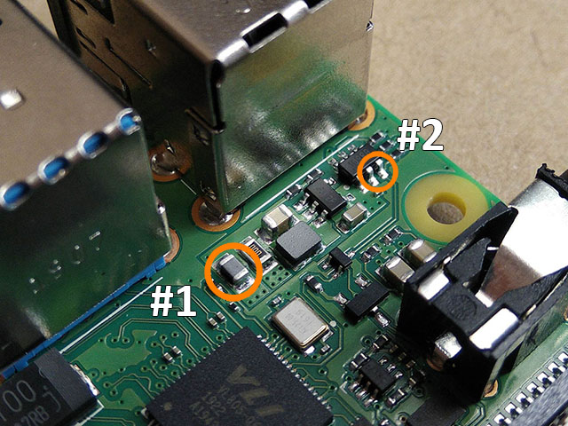

Raspberry Pi 4 PCIe Bridge "Chip"
==================================

A drop-in replacement for the VL805 USB controller IC that bridges the PCIe bus signals to the USB 3.0 connector on the Raspberry Pi 4.

[https://blog.zakkemble.net/rpi4-pci-express-bridge-chip/](https://blog.zakkemble.net/rpi4-pci-express-bridge-chip/)

Instructions
------------

A hot air rework station is required for the removal of the VL805 chip and placement of the bridge chip.  There is a lot of copper inside the Raspberry Pi PCB so it may take a long time for it to heat up enough to melt the solder. The area around the chip should be covered with Kapton tape (or two layers of foil) to protect plastic parts and other sensitive components from excessive heat. Be careful not to knock off the tiny capacitors around the chip and don't forget to remove the microSD card! After removing the VL805 try to remove as much solder as possible from the PCB pads.

The bridge chip is larger than the original chip (8x10mm vs 8x8mm) and needs to be sanded down slightly so that the solder pads on the RPi PCB are visible and stick out from underneath the bridge when it is placed down. Use very fine sandpaper and be careful not to damage the traces at the edge of the board (other than making them shorter when sanding). Do not sand any further than the white line.

Apply a tiny amount of fresh solder paste onto the RPi PCB pads that are going to be soldered to the bridge chip (and maybe a bit of paste on the bridge chip too), then place down the bridge chip and reflow the solder. You might have to press the bridge chip down firmly while reflowing to make sure the pads make contact with each other and so that any excess solder from the large ground pad is pushed into the hole near the centre of the bridge chip.

Once the bridge chip has been installed it might also be a good idea to remove the SMD ferrite bead that normally passes through 1.03V for powering the VL805 USB controller (grey component marked #1 below). Removing it can help stop any accidental shorts from overloading the regulator, which also supplies power to the CPU core.

Without the VL805 chip the USB 5V power outputs will be disabled. To re-enable you will need to bridge two pins with a bit of solder (6 pin IC marked #2 below, the two pins nearest the screw hole). Be careful, as some PCIe risers are not supposed to have 5V connected.

Now wait for everything to cool down and let's hope it works!

| PCIe Signal | USB Signal       | Direction                |
| ----------- | ---------------- | ------------------------ |
| REFCLK+     | D-               | Host -> Device           |
| REFCLK-     | D+               | Host -> Device           |
| HSO+        | RX-              | Host (TX) -> Device (RX) |
| HSO-        | RX+              | Host (TX) -> Device (RX) |
| HSI+        | TX-              | Device (TX) -> Host (RX) |
| HSI-        | TX+              | Device (TX) -> Host (RX) |
| RESET       | D- (lower port)  | Host -> Device           |
| WAKE (not connected on the Pi) | D+ (lower port)  | Device -> Host           |
| CLKREQ      | RX+ (lower port) | Host -> Device           |
| PONRST      | RX- (lower port) | Not a PCIe signal, connected like a reset pin on a microcontroller. |

NOTE: The PCIe spec allows for polarity inversion, where the + and - signals are allowed to be swapped.

--------

Zak Kemble

contact@zakkemble.net
