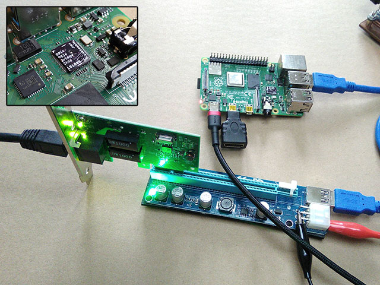

Raspberry Pi 4 PCIe Bridge "Chip"
==================================

A drop-in replacement for the VL805 USB controller IC that bridges the PCIe bus signals to the USB 3.0 connector on the Raspberry Pi 4.

[https://blog.zakkemble.net/rpi4-pci-express-bridge-chip/](https://blog.zakkemble.net/rpi4-pci-express-bridge-chip/)

--------

Zak Kemble

contact@zakkemble.net
